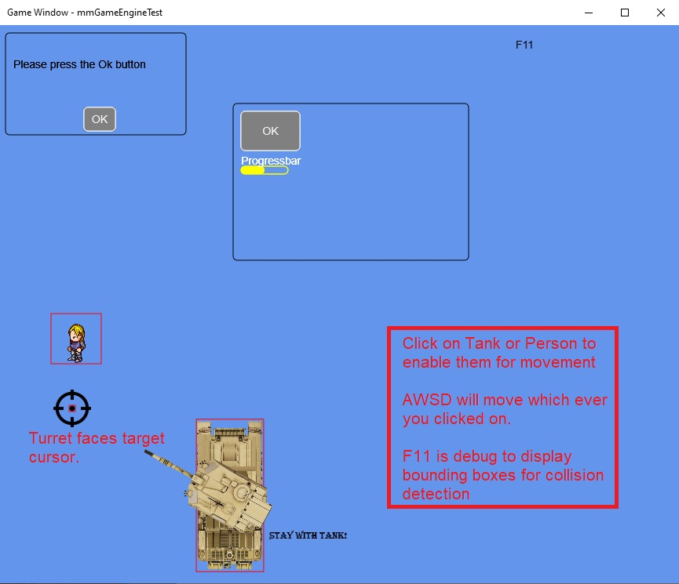
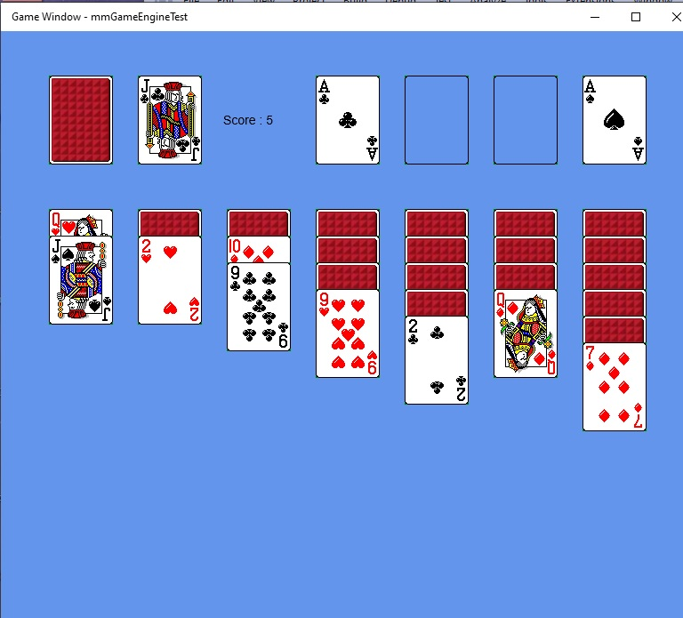

## Feb 08, 2024

Using Win2d CoreWindow (no WPF/XAML) to create game window.  I use swapchain which covers entire window, allowing for mouse clicks no matter how user resizes the window.
This is a 2D game framework engine.  I am waiting for Win2d to move into WindowsAppSdk and WinUI3 (as of Feb 8, 2024 no news https://github.com/microsoft/Win2D).

https://github.com/rocwood/Entitas-Lite        (I've included Entitas as part of engine, since I made some minor additions)

Entity Component System (ECS) is used to allow for separation of concern when coding (Entitas) 

Scene is the base of the game.  Inside the Scene you add an ENTITY that has a number of COMPONENTs.  Then you add one or more SYSTEM classes to act on those entities.  If you don't add a system, all you get is a scene displaying a bunch of sprites or UI.  

Each game is a scene holding Entities.
        
    * Game Entity (All the pieces used to do the game)
        
    * Scene Entity (typically UI elements that are drawn on top of all Game Entities)
    
There are included components that have special meaning.  
       
    Transform component gets added to all entities when scene creates them.
    
    Sprite component is used to display images
    
    SpriteAnimation component adds an animated sprite using spritesheet
    
    Tiled map component adds a TmxMap that allows you to access all of its levels & objects
    
    Text compoenent addes a text and will follow the entity on the screen 
    
    BoxCollider component allows the Entity to collide with other entities that have a collider

    UI components allow for communication with game

            Button 

            Grid

            Label

            Panel (holder for other UI, so you can place it anywhere)

            MsgBox (communicate with user with an OK button)

            
    
Systems do the guts of the logic of the game.  They are executed once every frame and process all entities that match certain components.

Below examples have "Debug" flag on.  F11 will flip "Debug" off/on.  Click on tank then move using WASD keys.  

The red boxes are BoxColliders drawn as debug guide.

## To Start a VS2022 project:

    Start with UWP app
       
    Add reference to mmGameEngine
 
## Your App.cs

using Windows.ApplicationModel.Core;

using mmGameEngine;

namespace mmGameEngineTest

{

    class App
    
    {
        //----------------
        // Step 01
        //----------------
        // Main entry into the game
        public static void Main(string[] args)
        {
            //
            //     Gets the main CoreApplicationView(IFrameworkViewSource)
            //     instance for all running apps that use this
            //     CoreApplication instance.
            //
            IFrameworkViewSource ivs = new ViewSource();
            //
            // Tell CoreApplication to run "ivs" using mmGameApp.cs (Step 03) which is IFrameworkView
            //            
            CoreApplication.Run(ivs);
        }
    }
    
    class ViewSource : IFrameworkViewSource
    {
        //----------------
        // Step 02
        //----------------
        public IFrameworkView CreateView()
        {
            Global.CurrentScene = new GameScene();
            //Global.CurrentScene = new CardScene();
            return Global.CurrentScene;
        }
    }
}

## Game Scene

## Card Game Scene

